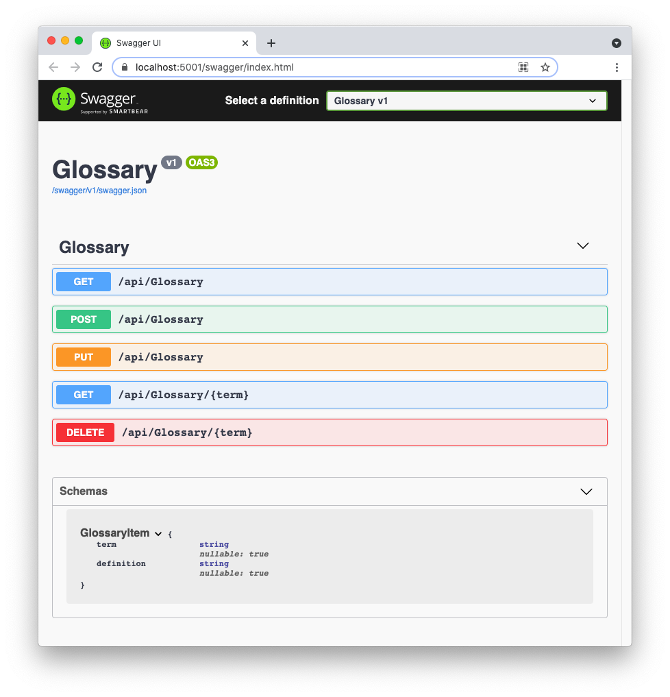

https://auth0.com/blog/aspnet-web-api-authorization/

## Integrating with Auth0 using JwtBearer
```
dotnet add package Microsoft.AspNetCore.Authentication.JwtBearer
or using package manager
PM> Install-Package Microsoft.AspNetCore.Authentication.JwtBearer
```
## appsettings.json
```
{
  "Logging": {
    "LogLevel": {
      "Default": "Information",
      "Microsoft": "Warning",
      "Microsoft.Hosting.Lifetime": "Information"
    }
  },
  "AllowedHosts": "*",
  "Auth0": {
    "Domain": "YOUR_AUTH0_DOMAIN",
    "Audience": "YOUR_UNIQUE_IDENTIFIER"
  }
}
```

## Testing with swagger

https://localhost:5001/swagger

login https://manage.auth0.com/, copy bearer token from tab "Test"


###########################################################################################


This repository contains a basic glossary CRUD Web API implemented in ASP.NET.

The following article describes the implementation details: [Tutorial: Building ASP.NET CRUD Web APIs](https://auth0.com/blog/building-aspnet-webapi/)

## To run this application:

1. Clone the repo with the following command: 

   ```bash
   git clone --branch starter --single-branch https://github.com/auth0-blog/glossary-web-api-aspnet.git
   ```

2. Move to the `glossary-web-api-aspnet` folder 

3. Type `dotnet run` in a terminal window to launch the Web API.

4. Point your browser to `https://localhost:5001/swagger` to test the available endpoints and actions.



## Requirements:

- [.NET Core SDK](https://dotnet.microsoft.com/download/dotnet/current) installed on your machine

